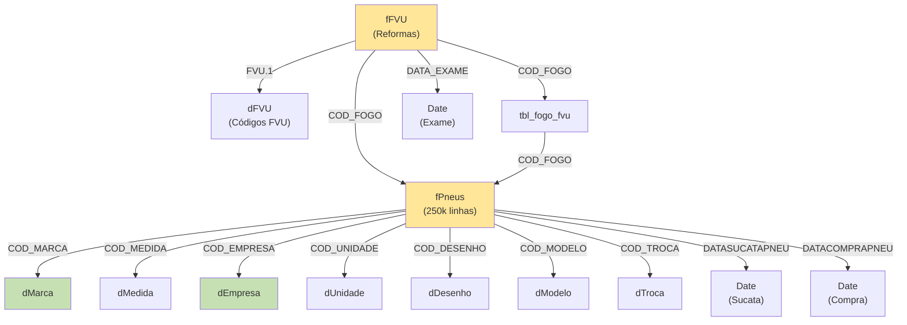

# Documentação Técnica - Análise de Pneus Saritur 🚚
## 📋 Visão Geral do Projeto
Este projeto Power BI (.pbip) implementa um sistema completo de análise de
vida útil de pneus (KM) para a frota da **Saritur**, combinando dados de
múltiplas fontes (SQL Server, Excel, Python ELT) com modelo semântico
robusto e relatórios interativos. O sistema rastreia desde a compra do pneu
até seu descarte, passando por reformas sucessivas.
---
## 1. 📊 Data Sources
### 1.1 Fonte Primária: SQL Server (BASE_STAGE_OFICINASMATERIAIS)
- **Servidor**: `192.168.0.11`
- **Banco de Dados**: `BASE_STAGE_OFFICINASMATERIAIS`
- **Tabelas Utilizadas**:
| Tabela | Descrição | Uso |
|--------|-----------|-----|
| `GLB_VWPNE_DADOSDOPNEU` | View com todos os dados de pneu (código fogo,
marca, medida, modelo, desenho, DOT, data de compra, condição) | Fatos
principais dos pneus |
| `STAGING_GLB_PNEU_TROCA` | Tabela de trocas de pneu (KM percorrido por
troca, código local, vida da troca) | Histórico de trocas e KM por vida |
| `DIM_EMPRESA_FILIAL` | Dimensão de empresa e filial (razão social) |
Contexto organizacional |
| `DIM_CadLocal` | Dimensão de locais (unidades, almoxarifados) |
Localização dos pneus |
**Filtros Aplicados**: Apenas marcas 1, 2, 3, 5, 6 | Dados a partir de 2018-
01-01
---
### 1.2 Fonte Secundária: Excel (combined_data/)
- **Arquivo**: `combined_data_2018_2025.xlsx`
- **Origem**: Planilhas mensais de 2018 até 2025
- **Columns**: COD_FOGO, KM Novo, Reformas (1ª, 2ª, 3ª), Reformadoras,
Desenhos, FVU, DATA_EXAME
- **Processo**: Concatenação de múltiplas planilhas via `app.py` (histórico)
e `app_mensal.py` (novos meses)
---
### 1.3 Fonte Auxiliar: Excel (dFVU.xlsx)
- **Arquivo**: `dFVU.xlsx`
- **Conteúdo**: Tabela de códigos FVU e suas descrições
- **Uso**: Dimensão para categorização de fundações
---
## 2. 🔄 Data Transformation (ELT - Python)
### 2.1 Script Histórico: `app.py` (DESCONTINUADO)
**Proposito**: Juntar todas as planilhas de 2018-2025 em um único arquivo
base.
```python
# Fluxo:
1. Ler todos os arquivos XLS da pasta combined_data/
2. Extrair colunas específicas (COD_FOGO, KM Novo, Reformas, Reformadoras,
Desenhos, FVU, DATA_EXAME)
3. Normalizar COD_FOGO (7 dígitos, zero-padded, sem 'A')
4. Renomear colunas para padrão DB (ex: "nº de Fogo\ndo pneu" → "COD_FOGO")
5. Remover linhas onde FVU está vazio (dropna)
6. Concatenar arquivos e exportar para combined_data_2018_2025.xlsx
```
**Status**: ⚠️ Não é mais necessário. Cada mês novo é processado
individualmente pelo `app_mensal.py`.
---
### 2.2 Script Ativo: `app_mensal.py` (VERSÃO ATUAL)
**Proposito**: Processar novos arquivos mensais chegando com nomenclatura
padrão.
```python
# Fluxo:
1. Ler arquivo XLS específico (ex: "FVU- JANEIRO-OK (5).xls")
2. Extrair e normalizar colunas (mesmo procedimento do app.py)
3. Aplicar limpeza:
 - Conversão numérica de COD_FOGO com zero-padding
 - Remoção de valores nulos em FVU
4. Exportar para arquivo temporal (ex: jan_2026.xlsx)
5. **MANUAL**: Incluir os dados na planilha
combined_data/combined_data_2018_2025.xlsx
```
**Fluxo de Atualização Mensal**:
```
┌─────────────────────────────────────────────┐
│ Chega novo arquivo mensal (ex: jan_2026.xls)│
└────────────────┬────────────────────────────┘
 │
 ▼
 ┌───────────────────────┐
 │ Rodar app_mensal.py │
 └─────────────┬─────────┘
 │
 ▼
 ┌─────────────────────────────────────┐
 │ Gera jan_2026.xlsx (normalizado) │
 └────────────────┬────────────────────┘
 │
 ▼
 ┌──────────────────────────────────────────┐
 │ Copiar dados para combined_data_xxx.xlsx │
 │ (Append de linhas) │
 └──────────────────────────────────────────┘
 │
 ▼
 ┌──────────────────────────────────────────┐
 │ Power BI atualiza automaticamente via │
 │ conexão Excel ao arquivo combined_data │
 └──────────────────────────────────────────┘
```
---
### 2.3 Transformações M (Power Query)
#### **fPneus** (Dados do SQL Server)
```m
Etapas Principais:
1. Connectar ao SQL Server via DSN
2. Executar query que faz LEFT JOIN entre GLB_VWPNE_DADOSDOPNEU e
STAGING_GLB_PNEU_TROCA
3. Substituir códigos de vida numéricos por texto:
 - "0" → "KM Novo"
 - "1" → "1º Reforma"
 - "2" → "2º Reforma"
 - "3" → "3º Reforma"
4. Limpar COD_FOGO (remover "A")
5. Remover duplicatas por (VIDA, COD_FOGO)
6. Modo: Import (dados em cache no Power BI)
```
**Colunas Críticas Criadas**:
- `perca_km` = IF(KMTOTAL < AVG(KMTOTAL), "KM Perdido", "Normal")
- `km_perdido` = KMTOTAL - Baseline(166007)
- `KMPORVIDA` = SUM(KMPERCORRIDOTRPNEU) OVER PARTITION BY COD_FOGO, VIDA
---
#### **fFVU** (Dados do Excel combinado)
```m
Etapas Principais:
1. Conectar ao arquivo combined_data_2018_2025.xlsx
2. Promover cabeçalhos
3. Limpar e padronizar:
 - Remover pontos e espaços de "KM Novo"
 - Remover apóstrofes de "1ª Reforma (KM)"
4. Converter tipos: KM → Int64, DATA_EXAME → Date
5. Capitalizar nomes de Reformadoras
6. Remover "A" de COD_FOGO
7. **Unpivot** das colunas de Reforma → linha única por reforma
 - Separar "1º Reforma (KM)" em Vida=1º, KM=valor
 - Separar "1º Reformadora" em Vida=1º, Reformadora=valor
 - Separar "1º Desenho" em Vida=1º, Desenho=valor
8. Pivot novamente para estrutura final
9. **Join com fPneus** para adicionar KMTOTAL
10. Remover duplicatas por (COD_FOGO, Vida)
```
---
### 2.4 Dimensões (Dimensões do SQL Server)
| Dimensão | Fonte | Transformações |
|----------|-------|-----------------|
| **dMarca** | SQLServer | DISTINCT, Text.Proper() |
| **dDesenho** | SQLServer | DISTINCT, Text.Proper(), sort |
| **dModelo** | SQLServer | DISTINCT, Text.Proper() |
| **dMedida** | SQLServer | DISTINCT |
| **dEmpresa** | SQLServer | DISTINCT, remove Autotrans, Text.Proper() |
| **dUnidade** | SQLServer | DISTINCT, remove "ALMOX." e "ATENDIMENTO" |
| **dTroca** | SQLServer | DISTINCT |
| **dFVU** | Excel | Local, Text.Proper() |
---
## 3. � Semantic Model (DAX)
### 3.1 Arquitetura do Modelo
```
┌─────────────────────────────────┐
│ FATOS (Import) │
├─────────────────────────────────┤
│ ➤ fPneus │ (250k+ linhas)
│ └─ 15+ medidas DAX │
│ ➤ fFVU │ (Excel, reformas)
│ └─ 4 medidas DAX │
│ ➤ tbl_fogo_fvu (auxiliar) │
└──────────────────────────────────┘
 ↓ OneToMany
┌──────────────────────────────────┐
│ DIMENSÕES (Lookup) │
├──────────────────────────────────┤
│ ➤ dMarca, dDesenho, dModelo │
│ ➤ dMedida, dEmpresa, dUnidade │
│ ➤ dTroca, dFVU │
│ ➤ Date Tables (3 calendários) │
└──────────────────────────────────┘
```
---
### 3.2 Medidas DAX - Tabela fPneus
#### **Media_KM_Novo_Real_Globus** 📊
```dax
CALCULATE(AVERAGE(fPneus[KMPORVIDA]), fPneus[VIDA] = "KM Novo")
```
- **Objetivo**: Média de quilometragem inicial por pneu
- **Lógica**: Calcula a média de KMPORVIDA apenas para registros onde
VIDA="KM Novo"
- **Negócio**: KPI de pressão/desgaste inicial - quanto um pneu novo roda
até primeira reforma
- **Formato**: Geral (número)
---
#### **Media_KM_Novo_Real2** 📊
```dax
AVERAGEX(
 VALUES('fPneus'[COD_FOGO]),
 CALCULATE(MAX('fPneus'[KMPORVIDA]), fPneus[VIDA] = "KM Novo")
)
```
- **Objetivo**: Média de KM novo com contexto de pneu individual
- **Lógica**:
 1. Itera sobre cada COD_FOGO único
 2. Para cada pneu, calcula o MAX de KMPORVIDA onde VIDA="KM Novo"
 3. Faz a média desses máximos
- **Negócio**: Evita dupla-contagem; mais preciso que
Media_KM_Novo_Real_Globus
- **Formato**: #,0
---
#### **total_perdido** ❌
```dax
CALCULATE(AVERAGE(fPneus[km_perdido]), fPneus[perca_km] = "KM Perdido") * -1
```
- **Objetivo**: Média de KM perdido em relação ao baseline
- **Lógica**:
 1. Filtra apenas pneus com perca_km="KM Perdido" (abaixo da média)
 2. Calcula AVERAGE(km_perdido) = AVG(KMTOTAL - 166007)
 3. Multiplica por -1 para exibir como valor positivo
- **Negócio**: Identificar pneus com rendimento abaixo do esperado
- **Formato**: Geral
---
### 3.3 Medidas DAX - Tabela fFVU
#### **Contagem_Vidas** 🔢
```dax
DISTINCTCOUNT('fFVU'[Vida])
```
- **Objetivo**: Quantas vidas diferentes um pneu teve
- **Negócio**: Indicador de intensidade de uso - mais vidas = mais reformas
- **Formato**: 0 (inteiro)
---
#### **Media_Vidas_por_Marca** 📈
```dax
AVERAGEX(
 VALUES('fFVU'[COD_FOGO]),
 [Contagem_Vidas]
)
```
- **Objetivo**: Média de vidas por marca de pneu
- **Lógica**: Itera pneus únicos e calcula a média de [Contagem_Vidas]
- **Negócio**: Qualidade comparativa entre marcas - qual marca aguenta mais
reformas
- **Formato**: Geral
---
#### **Media_KM_Novo_Real** 🚗
```dax
AVERAGEX(
 VALUES('fFVU'[COD_FOGO]),
 CALCULATE(MAX('fFVU'[KM Novo]))
)
```
- **Objetivo**: Média de KM novo dos pneus em análise de FVU
- **Lógica**: Para cada refo único, pega o KM Novo máximo e faz média
- **Negócio**: Comparar rendimento inicial entre diferentes análises de FVU
- **Formato**: Geral
---
#### **conta_FVU** 🏢
```dax
DISTINCTCOUNT(fFVU[FVU.1])
```
- **Objetivo**: Quantas fundações/locais diferentes no resultado
- **Negócio**: Performance por localização/fundação
- **Formato**: 0 (inteiro)
---
### 3.4 Colunas Calculadas (Computed Columns)
| Coluna | Tabela | Fórmula | Propósito |
|--------|--------|---------|-----------|
| `perca_km` | fPneus | `IF(KMTOTAL < AVG(KMTOTAL), "KM Perdido", "Normal")`
| Classificar pneus com baixo rendimento |
| `km_perdido` | fPneus | `KMTOTAL - 166007` | Variação em relação ao
baseline esperado |
---
### 3.5 Relacionamentos (Star Schema)

---
## 4. 📈 Visual Hierarchy (Páginas do Relatório)
### 4.1 Página 1: "KM Novo" 🚗
**Ordem**: Primeira página do relatório
**Propósito**: Análise de rendimento do pneu na vida inicial
#### Visuals Inclusos:
- **Card KPI**: Média de KM Novo (Meta: 120,000 km)
- **Gráfico de Barras**: KM Novo por Marca
- **Tabela**: Detalhes - COD_FOGO, Marca, KM Novo, Data Compra
- **Filtro**: Período (Data Compra)
- **Segmentador**: Marca, Empresa, Unidade
#### Insights Entregues ao Gestor:
- Qual marca rende mais na primeira vida
- Distribuição de rendimento entre centros de operação
- Tendência histórica (2018-2025) de degradação ou melhoria
- Anomalias (pneus com KM muito abaixo da média)
---
### 4.2 Página 2: "KM Reformado" 🔧
**Ordem**: Segunda página
**Propósito**: Análise de eficiência das reformas (1ª, 2ª, 3ª)
#### Filtro Padrão:
- Apenas pneus em condição "SU" (Sucata) e "VE" (Vencido)
- Filter Config: CONDICAOPNEU IN ('SU', 'VE')
#### Visuals Inclusos:
- **Gráfico de Colunas Agrupadas**: KM por Reforma (1ª, 2ª, 3ª)
- **Card**: Média de Vidas por Pneu
- **Tabela**: Histórico de Reformas - COD_FOGO, 1º Reformadora, 1º KM, 2º
Reformadora, 2º KM, etc.
- **Mapa Interativo**: Distribuição geográfica de reformas por Unidade
- **Cross-filtering**: Clicando em Marca filtra todas as outras visuals
#### Insights Entregues:
- Qual reformadora produz melhor rendimento (consistência)
- Diferença de KM entre 1ª e 2ª reforma (degradação)
- Taxa de pneus que chegam a 3ª reforma
- Oportunidades de otimização por reformadora
---
### 4.3 Página 3: "FVU" 🏢 (HOME)
**Ordem**: Terceira página (ativa por padrão)
**Propósito**: Análise de Fundação de Vida Útil e performance das análises
#### Filtro Padrão:
- Apenas pneus em condição "SU", "VE"
#### Visuals Inclusos:
- **Card Principal**: Contagem Total de FVU Analisadas
- **Gráfico de Rosca**: Distribuição de Vidas (KM Novo, 1ª Reforma, 2ª
Reforma, 3ª Reforma)
- **Tabela com Drill-down**: FVU → COD_FOGO → Detalhes (Marca, Medida,
Modelo, Vida, KM Total)
- **Matriz**: FVU vs Marca vs Média de Vidas
- **Gantt/Timeline**: Linha do tempo de análises de FVU por período
#### Cross-Filtering:
- Clicando em um FVU filtra automaticamente as outras visuals
- Selecionando uma Marca refina os dados
#### Insights Entregues:
- Quais codes de FVU mais aparecem (padrão de falha)
- Correlação entre FVU e marca do pneu
- Vida média dos pneus analisados por FVU
- Frequência de análises ao longo do tempo
---
### 4.4 Interações Entre Visuals (Visual Interactions)
As páginas implementam **bi-directional cross-filtering**:
```
Exemplo em "KM Reformado":
┌─────────────┐ ┌──────────────┐
│ Marca │◄────► │ KM Gráfico │
│ (Seletor) │ 1:M │ │
└─────────────┘ └──────────────┘
 ▲ 1:M │ 1:M
 │ │
 └──────────────┬───────┘
 │
 ┌──────▼────────┐
 │ Reformadora │
 │ (Tabela) │
 └───────────────┘
```
---
## 5. 🛠️ Maintenance - Como Adicionar Novo Mês
### 5.1 Workflow de Atualização Mensal
**Step 1: Preparar o arquivo mensal**
```
📁 Pasta de Entrada: Downloads/ ou Email Attachments/
📄 Nome Esperado: "FVU- [MÊS]-OK (X).xls"
 Exemplo: "FVU- FEVEREIRO-OK (1).xls"
```
---
**Step 2: Rodar o Script de Limpeza**
No terminal (`Windows PowerShell`):
```powershell
# Navegar até o diretório do projeto
cd "C:\Users\Anl-suprimentos\Documents\FVU"
# Executar o script (modificar o caminho do arquivo)
python app_mensal.py
# OU se Python não está no PATH
python.exe app_mensal.py
```
**Esperado**:
- ✅ Sem erros de encoding
- ✅ Arquivo `jan_2026.xlsx` criado com ~ 1000-3000 linhas
- ✅ Colunas: COD_FOGO, KM Novo, 1ª Reforma (KM), 1º Reformadora, 1º
Desenho, 2ª Reforma (KM), 2º Reformadora, 2º Desenho, 3ª Reforma (KM), 3º
Reformadora, 3º Desenho, FVU, DATA_EXAME
---
**Step 3: Integrar com combined_data**
**Opção A (Manual Simples)**:
1. Abrir `combined_data\combined_data_2018_2025.xlsx`
2. Ir até a última linha com dados
3. Copiar o conteúdo de `jan_2026.xlsx` (sem cabeçalho)
4. Colar na próxima linha
5. Salvar e fechar
**Opção B (Semi-Automática - recomendado)**:
Criar um script `append_monthly.py`:
```python
import pandas as pd
from datetime import datetime
# Ler arquivo novo
novo = pd.read_excel(r'C:\...\jan_2026.xlsx')
# Ler arquivo base
base = pd.read_excel(r'C:\...\combined_data_2018_2025.xlsx')
# Concatenar
resultado = pd.concat([base, novo], ignore_index=True)
# Remover duplicatas de (COD_FOGO, DATA_EXAME)
resultado = resultado.drop_duplicates(subset=['COD_FOGO', 'DATA_EXAME'],
keep='last')
# Salvar
resultado.to_excel(r'C:\...\combined_data_2018_2025.xlsx', index=False)
print(f"✅ Atualizado com {len(novo)} linhas. Total agora:
{len(resultado)}")
```
---
**Step 4: Atualizar Power BI**
1. Abrir `Relatório Pneus.pbip` no Power BI Desktop
2. Ir para **Home** → **Refresh**
3. Aguardar sincronização (2-5 minutos dependendo do tamanho)
4. Verificar valores nas páginas:
 - KM Novo: Deve incluir novo mês
 - KM Reformado: Deve refletir reformas do novo mês
 - FVU: Novas análises FVU devem aparecer
---
### 5.2 Checklist de Validação Pós-Atualização
- [ ] Arquivo `combined_data_2018_2025.xlsx` foi atualizado com novas linhas
- [ ] Power BI refresh completou sem erros
- [ ] Total de linhas em fPneus aumentou
- [ ] Total de linhas em fFVU aumentou
- [ ] Cards de "Contagem" mostram novos valores
- [ ] Nenhum valor é "nulo" ou "infinito" nas medidas
- [ ] Datas do novo mês aparecem nos filtros de período
- [ ] Gráficos atualizam corretamente ao mudar filtros
- [ ] Não há duplicatas de (COD_FOGO, DATA_EXAME)
---
### 5.3 Troubleshooting Comum
| Problema | Causa | Solução |
|----------|-------|---------|
| Script Python falha em "usecols" | Arquivo tem colunas nomeadas diferente
| Abrir o XLS e conferir nomes exatos das colunas |
| Arquivo fica com encoding ruim | XLS salvo em ASCII | Salvar como XLS com
encoding UTF-8 |
| Power BI não atualiza | Cache de Query não foi limpo | Home → Edit Queries
→ Refresh All |
| Duplicatas de COD_FOGO no mesmo mês | Arquivo original tinha dados duplos
| Rodar `.drop_duplicates()` antes de append |
| KM Novo = 0 para alguns pneus | Coluna "KM Novo" ficou como texto |
Converter para Int64 no Query Editor |
---
### 5.4 Ciclo Mensal Recomendado
```
┌─────────────────────────────────────────────────┐
│ Todo Dia 5 do Mês Seguinte (ou conforme chegar) │
└────────────┬────────────────────────────────────┘
 │
 ▼
 ┌─────────────────────┐
 │ 1. Receber arquivo │
 │ mensal via email │
 └────────────┬────────┘
 │
 ▼
 ┌─────────────────────────────┐
 │ 2. Rodar app_mensal.py │
 │ (não precisa parar BI) │
 └────────────┬────────────────┘
 │
 ▼
 ┌─────────────────────────────────┐
 │ 3. Append em combined_data.xlsx │
 │ (validar duplicatas) │
 └────────────┬────────────────────┘
 │
 ▼
 ┌─────────────────────────────────┐
 │ 4. Abrir BI Desktop │
 │ → Refresh agora │
 │ (3-5 min em background) │
 └────────────┬────────────────────┘
 │
 ▼
 ┌─────────────────────────────────┐
 │ 5. Publicar no Power BI Service │
 │ (se aplicável) │
 └────────────┬────────────────────┘
 │
 ▼
 ┌─────────────────────────────────┐
 │ 6. Comunicar ao gestor que │
 │ dados foram atualizados │
 └─────────────────────────────────┘
Total: ~30 min (incluindo validação)
```
---
## 6. 📝 Dicionário de Dados
### Tabela de Fatos: fPneus
| Campo | Tipo | Fonte | Significado |
|-------|------|-------|-----------|
| `COD_FOGO` | String | Tire ID | Código único do pneu (7 dígitos) |
| `KMPORVIDA` | Int64 | Window Sum | KM acumulado para cada vida do pneu |
| `KMTOTAL` | Double | SQL View | KM total desde compra até descarte |
| `VIDA` | String | Transformado | Qual vida: "KM Novo", "1º Reforma", "2º
Reforma", "3º Reforma" |
| `CONDICAOPNEU` | String | SQL View | Condição: "SU" (Sucata), "VE"
(Vencido), "BO" (Bom) |
| `DATASUCATAPNEU` | Date | SQL View | Quando o pneu foi descartado |
| `DATACOMPRAPNEU` | Date | SQL View | Quando o pneu foi comprado |
| `CONDICAOPNEU` | String | SQL View | Material/condição do pneu |
| `perca_km` | String | Calculated | Classificação: "KM Perdido" ou "Normal"
|
| `km_perdido` | Double | Calculated | Variação em relação ao baseline
(166,007 km) |
---
### Tabela de Fatos: fFVU
| Campo | Tipo | Fonte | Significado |
|-------|------|-------|-----------|
| `COD_FOGO` | String | Excel | Código do pneu |
| `Vida` | String | Excel Unpivot | Qual reforma foi analisada |
| `KM Novo` | Int64 | Excel | KM na vida inicial |
| `KM Reformado` | Int64 | Excel Unpivot | KM na reforma (1ª, 2ª, 3ª) |
| `Reformadora` | String | Excel | Qual empresa fez a reforma |
| `Desenho` | String | Excel | Padrão do pneu na reforma |
| `KM Total` | Double | Join fPneus | KM total acumulado |
| `DATA_EXAME` | Date | Excel | Data da análise FVU |
| `FVU.1` | String | Excel Unpivot | Código de fundação (primeira 3 letras)
|
---
### Dimensão: dMarca
| Campo | Tipo | Valores Típicos |
|-------|------|------------|
| `COD_MARCA` | String | 1, 2, 3, 5, 6 |
| `MARCA` | String | "Bridgestone", "Continental", "Michelin", etc. |
---
### Dimensão: dDesenho
| Campo | Tipo | Valores Típicos |
|-------|------|------------|
| `COD_DESENHO` | Int64 | 1-999 |
| `DESENHO` | String | "Pneu Diagonal", "Radial", "All Terrain", etc. |
---
## 7. 🚀 Boas Práticas & Convenções
### 7.1 Nomenclatura
- **Arquivos temporários**: `{mes}_{ano}.xlsx`
- **Arquivos base**: `combined_data_YYYY.xlsx`
- **Scriptsς Python**: `app_{nome_descritivo}.py` (snake_case)
- **Medidas DAX**: `{Calculo}_{Dimensao}` (ex: `Media_KM_Novo`)
- **Colunas calculadas**: descrição em português (ex: `perca_km`)
### 7.2 Versionamento do Power BI
- Salvar como `.pbip` (Project format) para melhor controle de versão
- Commit após cada atualização maior:
 ```
 "Update: Adicionado mês Jan 2026, 2,500 linhas"
 ```
### 7.3 Segurança de Dados
- ✅ Apenas marcas 1,2,3,5,6 aparecem (outras filtradas)
- ✅ Apenas empresas válidas (Autotrans removida)
- ✅ Dados a partir de 2018 (histórico controlado)
---
## 8. 📞 Suporte & Referências
**Em Caso de Problemas**:
1. Verificar erro no terminal (Python script)
2. Validar estrutura do arquivo XLS mensal
3. Checar se `combined_data_2018_2025.xlsx` está com permissão de escrita
4. Confirmar conexão ao SQL Server (ping 192.168.0.11)
5. Verificar se Power BI está aberto (pode caus conflicos de arquivo)
**Documentação Relacionada**:
- [Power BI DAX Function Reference](https://dax.guide)
- [Power BI Report Server REST API](https://learn.microsoft.com/power-bi/)
---
**Última Atualização**: 23 de março de 2026
**Versão do Projeto**: 2.0 (app_mensal.py ativo)
**Sucessor**: [Nome do próximo responsável]